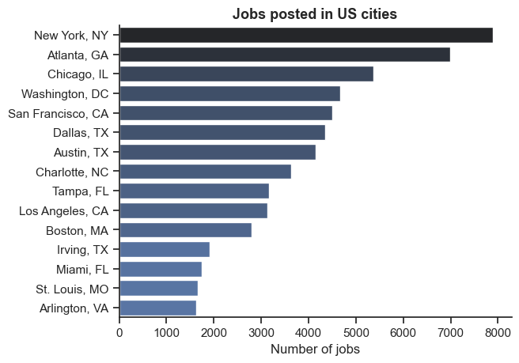
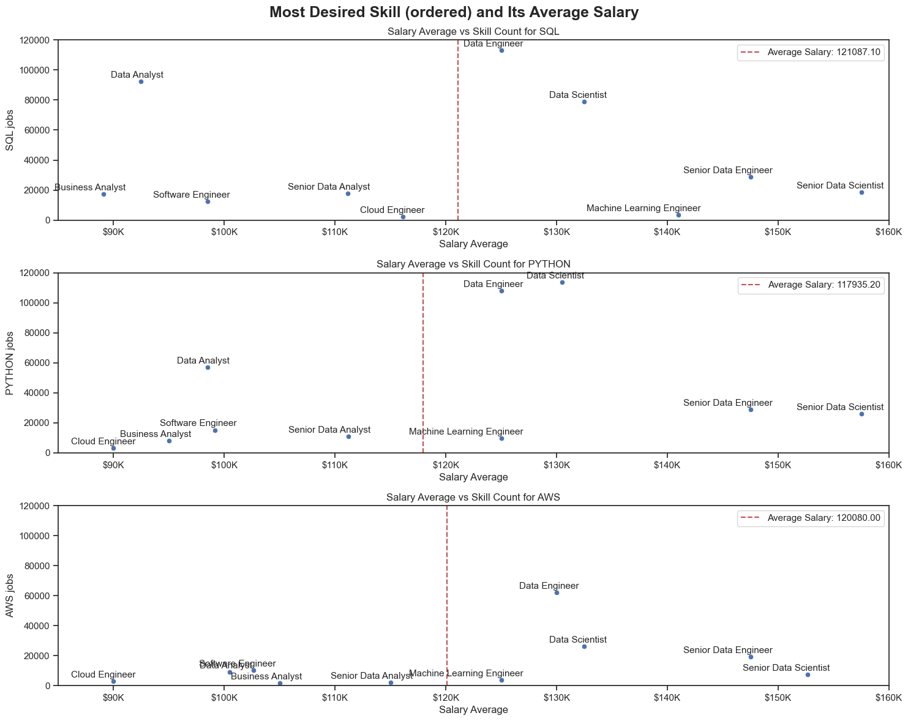

# Overview

Welcome to my CAPSTONE project on data analysis using Python. 

This project was created out of a desire to figure out what kind of skill I should learn next. It delves into the top-paying and in-demand skills to help find optimal job opportunities that involve working with data.

The data is sourced from [Luke Barousse's Python Course](https://lukebarousse.com/python), which provides the foundation for my analysis, containing detailed information on job titles, salaries, locations, and essential skills. Through a series of Python scripts, I explore key questions such as the most demanded skills, salary trends, and the intersection of demand and salary in data analytics.

# The Questions
Below are the questions I aim to answer in my project:

1. Where are tech jobs being offered?
2. What job roles are earning above average across the three most popular skills?
3. Diving deeper into jobs that earns the most, what are the most requested skils for those jobs?
4.  Specifically for Senior Data Scientist, the highest skill ceiling, what is the pay distribution, and who is offering the outliers?

These questions aim to address the overarching inquiry about my own development. As graduation approaches, my experiences have taught me to always look ahead and prepare. Therefore, I want to learn about my end goal. I plan to use this data to understand which job roles and which skills I should pursue.

# Tools I Used

For my deep dive into the data analyst job market, I harnessed the power of several key tools:

- **Python:** The backbone of my analysis, allowing me to analyze the data and find critical insights. I also used the following Python libraries:
    - **Hugging Face:** The data is hosted on this popular machine learning hub. Python was used to extract the data.
    - **Pandas:** Used for data analysis and manipulation.
    - **Matplotlib:** Utilized for data visualization.
    - **Seaborn:** Helped me create advanced visualizations.
- **Jupyter Notebooks:** The tool I used to run my Python scripts, allowing me to easily include notes and analysis.
- **Visual Studio Code:** My go-to tool for executing Python scripts.
- **Git & GitHub:** Essential for version control and sharing my Python code and analysis, ensuring collaboration and project tracking.

# Understanding the structure of the data
This section outlines the steps taken to understand the content inside the data. This step also prep the data for analysis, ensuring accuracy and usability.

Let's start by importing the data, and viewing the structure of the data. Feel free to access my notebook with detailed steps here: [Exploratory](3_Project\1_EDA_intro.ipynb).

```python
import pandas as pd
from datasets import load_dataset
import ast
import seaborn as sns
import matplotlib.pyplot as plt

#loading data
df = load_dataset('lukebarousse/data_jobs')['train'].to_pandas()

#data clean up
df['job_posted_date'] = pd.to_datetime(df['job_posted_date'])

df.describe()
df.info()
df.iloc[0:2]

job = ['Data Analyst']
country = ['United States']
##Data cleanup

df_US = df[df.job_country.isin(country)].copy()

#filter to US jobs and data analyst jobs
df_DA_US = df[(df.job_country.isin(country)) & (df.job_title_short.isin(job))].copy()
#transition the str skills to list 
df_US['job_skills'] = df_US['job_skills'].apply(lambda skill: ast.literal_eval(skill) if pd.notna(skill) else skill)

df_explode = df_US.explode('job_skills')
#capitalize the name of the skills 
df_explode['job_skills']=df_explode['job_skills'].str.capitalize()
```
```python
df.job_posted_date.dt.year.value_counts()
```
By running the above code, I understood that the data only runs in the year 2023, thus historical analysis is limited to only year 2023. 

Other aspects of the data are: 
- Many data points in the column 'salary_hour_avg', 'salary_year_avg', and salary_rate are N/A values. Albeit, there are at least 4000 data points.
- Majority of the data is for jobs in the United States; however, there are still plenty of data from around the world.
- The three most popular skills in the US are: SQL, Python, and AWS

# Analysis
Each Jupyter notebook for this project aimed at investigating specific aspects of the data job market. Here’s how I approached each question:

## 1. Where are tech jobs being offered? 
[code here](3_Project\1_EDA_intro.ipynb)


As a young professional, I recognize the importance of positioning myself in areas that offer ample resources for growth. One interesting aspect I explored is which states have the highest recruitment for data jobs.

```python
import seaborn as sns

df_locations = (
    df_US['job_location']
    .value_counts()   #get the job count in each location
    .iloc[1:]       #get rid of the first one which is Anywhere
    .to_frame().head(15) #get 15 locations
)
df_locations.columns = ['count']  # Set the column name to 'count'

sns.set_theme(style='ticks')
sns.barplot(data=df_locations, x='count', y=df_locations.index,hue ='count', palette='dark:b_r', legend=False)
sns.despine()

plt.title('Jobs posted in US cities', fontsize = 13, fontweight='bold')
plt.ylabel('')  # Correct usage as a function
plt.xlabel('Number of jobs')  # Correct usage as a function
plt.show()
```


*Fig. 1 Bar chart visualizing job availability across different cities. Jobs postings with 'Anywhere' and 'United States' are obsoleted because of ambiguity.*

Fig. 1 shows the distribution of job postings across various U.S. cities, with New York, NY, Atlanta, GA, and Chicago, IL leading as the top three cities with the highest number of job postings. However, focusing on Texas, it stands out as a key technology hub, with cities like Dallas, Austin, and Irving each appearing prominently on the list. Collectively, these Texas cities highlight a significant concentration of data job opportunities, reinforcing Texas's growing reputation as a competitive hub for technology and data-driven roles. This trend suggests a shift in the tech landscape, where Texas is becoming an attractive destination for both companies and talent within the tech industry.

## 2. What are the job roles that is earning above average across the most three popular skills?
[code here](3_Project\2_Skill_Demand_&_3_Data_Roles.ipynb)

As previously mentioned, the three most popular skills in the data job market are SQL, Python, and AWS. Committing to mastering these skills will be a significant journey, and any journey should be approached with seriousness and dedication. 

I aim to understand the pay structure associated with jobs requiring these skills. Additionally, I seek insights into which development path I should pursue to build upon the skills I acquire.

``` python
top_3 = df_explodes['job_skills'].value_counts().head(3).index.to_list()
#['sql', 'python', 'aws']

# Function to format y-axis labels
def y_format(x, pos):
    return f'${int(x/1000)}K'

# Create subplots with 1 row and 3 columns
fig, axes = plt.subplots(3, 1, figsize=(15, 12))

for i, skill in enumerate(top_3):
    ax = axes[i]
    df_skill = df_title[df_title['job_skills'] == skill].copy()

    # Assuming df_sql is your DataFrame
    temp_avg = df_skill['salary_avg'].mean()   

    # Scatter plot on the subplot using Seaborn
    scatter_plot = sns.scatterplot(data=df_skill, x='salary_avg', y='skill_count', ax=ax)
    
    # Label the points with the names in 'job_title_short'
    for j, txt in enumerate(df_skill['job_title_short']):
        ax.annotate(txt, (df_skill['salary_avg'].iloc[j] + 2000, df_skill['skill_count'].iloc[j]+ 2500), fontsize=11, ha = 'right')
    
    #set ylim and xlim to be the same
    ax.set_xlim(85000,160000)
    ax.set_ylim(0,120000)

    # Set a white background with white grid
    sns.set_theme(style="ticks")
    
    # Draw a horizontal line for the median salary
    sql_avg = df_skill['salary_avg'].mean()
    ax.axvline(x=sql_avg, color='r', linestyle='--', label=f'Average Salary: {sql_avg:.2f}')
    
    # Apply the custom y-axis formatter
    ax.xaxis.set_major_formatter(FuncFormatter(y_format))
    
    # Customize labels and title
    ax.set_xlabel('Salary Average')
    ax.set_ylabel(f'{skill.upper()} jobs')
    ax.set_title(f'Salary Average vs Skill Count for {skill.upper()}')
    
    # Add legend for the median line
    ax.legend()

# Show the plot
plt.suptitle('Most Desired Skill (ordered) and Its Average Salary', fontsize = 18, fontweight='bold')
plt.tight_layout()
plt.show()
```


*Fig.2 Chart displays the most desired skills (SQL, Python, and AWS) in relation to job counts and their average salary.*

Fig. 2 highlights three essential skills—SQL, Python, and AWS—that are critical for many data-related jobs, and the good news is, these skills pay well. Although Python, the most versatile programming language, has a lower average salary compared to SQL and AWS, its salary range is less spread out, indicating more stability across different roles. Data analyst positions, while offering the highest number of jobs, tend to start with lower salaries around $90K.

The data reveals a clear career progression: data analysts can advance to more lucrative positions like data scientists, where salaries jump significantly. The ultimate prestigious role is the senior data scientist, with earnings reaching up to $160K. Additionally, machine learning engineers are becoming another leading frontier, driven by high demand and competitive salaries.

Based on this insight, the ideal path for me would be to start as a data analyst, progress to data scientist, move on to senior data scientist, and eventually transition into a project manager role (data not shown here), where I can lead and oversee data-driven projects.

## 3. Diving deeper into jobs that earns the most, what are the most requested skils for those jobs?
[code here](3_Project\2_Skill_Demand_&_3_Data_Roles.ipynb)

Next, I'll explore jobs that offer salaries above the average and examine the additional skills required for those roles. This analysis will help identify the key competencies that contribute to higher-paying positions, providing insight into the skill sets essential for advancing beyond the average salary range in data-related careers. 

By understanding these requirements, I can tailor my skill development to align with the demands of high-paying roles in the industry.

```python
# List of job titles for which the top skills will be plotted
top_paying_jobs = ['Data Scientist', 'Senior Data Engineer', 'Senior Data Engineer', 'Machine Learning Engineer', 'Data Engineer']


# Set up the figure and axes for subplots
fig, ax = plt.subplots(len(top_paying_jobs), 1, figsize=(8, 12))

# Set the seaborn theme for cleaner visuals
sns.set_theme(style="ticks")

# Function to format y-axis labels
#can only format numbers, str value can not be formated
def x_format(x, pos):
    return f'{int(x)}%'


# Loop over each job title and generate a plot for the top 3 skills
for i, job_title in enumerate(top_paying_jobs):
        #sum of all the skills within the job 
    sum = df[df['job_title_short']==job_title]['job_title_short'].count()

    df_skills_count['changing pct'] = df_skills_count['skill_count']/sum * 100

    # Filter data for the current job title and get the top 3 skills
    df_plot = df_skills_count[df_skills_count['job_title_short'] == job_title].head(5)


    # Create a horizontal barplot using Seaborn, assigning hue to the y-axis (job_skills)
    sns.barplot(
        x='changing pct', 
        y='job_skills', 
        data=df_plot, 
        ax=ax[i], 
        hue='job_skills',  # Assign hue to y variable
        palette='Blues_d',  # Darker blue palette
        legend=False  # Disable legend
    )
    
    #Add labels
    for n, v in enumerate(df_plot['changing pct']):
        ax[i].text(v + 1, n, f'{v:.1f}%')

    # Apply the custom x-axis formatter
    ax[i].xaxis.set_major_formatter(FuncFormatter(x_format))
    # Apply the custom y-axis formatter
    #ax[i].yaxis.set_major_formatter(FuncFormatter(y_format))

    # Set the title for each subplot
    ax[i].set_title(f"Top Skills for {job_title}", fontsize=12, fontweight='bold')
    
    # Invert y-axis so the highest skill appears on top
    #ax[i].invert_yaxis()
    
    # Set consistent x-axis limits for all subplots
    ax[i].set_xlim(0,75)
    
    # Remove y-axis labels (to avoid clutter)
    ax[i].set_xlabel('')
    # Remove x-axis labels (to avoid clutter)
    ax[i].set_ylabel('')

    # Hide the grid to make it cleaner
    ax[i].grid(True, which='both', axis='x', linestyle='--')

# Add a universal title for the figure
fig.suptitle('Likelihood of Skills in US for Key Data Roles', fontsize=15, fontweight='bold')

# Add a common y-axis label
#fig.text(0.04, 0.5, 'Job Skills', va='center', rotation='vertical', fontsize=12)

# Adjust layout to prevent overlap and give space for titles
fig.tight_layout()

# Show the plot
plt.show()
```


*Fig.3 Chart shows the percentage of mentions for the most common skills required for high-paying data roles in the US.*

Fig. 3 offers a comprehensive look at the skills needed for various data roles. It highlights the importance of a strong foundation in Python and SQL while also emphasizing the need for specialization in areas like data engineering and machine learning.

For aspiring data professionals, this analysis suggests:

- **Prioritize Python and SQL:** These languages serve as the bedrock of data science.
- **Choose a Specialization:** Decide on a career path based on interests and goals.
- **Acquire Relevant Skills:** Develop the specific skills required for your chosen specialization.
- **Stay Updated:** The field of data science is constantly evolving, so stay informed about the latest trends and technologies.

By following these guidelines, I can position myself for a successful career in data science.

## Transition to Senior Data Scientist Roles

With a solid understanding of the skills and specializations needed for various data roles, it is essential to delve deeper into the Senior Data Scientist position—the pinnacle of skill and experience in the data field. Specifically, I will analyze the pay distribution for Senior Data Scientists and identify the companies that are offering the highest salaries. This exploration will provide valuable insights into what it takes to reach the upper echelons of the data profession and the financial rewards that come with it.

## 4. Specifically for Senior Data Scientist, the highest skill ceiling, what is the pay distribution, and who is offering the outliers?

[code here](3_Project\4_Senior_DS_pay.ipynb)


```python
import matplotlib.pyplot as plt
import seaborn as sns
import matplotlib.ticker as ticker

# Set seaborn theme
sns.set_theme(style="ticks")

# Calculate the median
median_salary = df_DA_US['salary_year_avg'].median()

# Create a figure with 1 column and 2 rows
fig, axes = plt.subplots(nrows=2, ncols=1, figsize=(10, 10))

# Create the box plot
sns.boxplot(x=df_DA_US['salary_year_avg'], color='royalblue', ax=axes[0])
axes[0].axvline(median_salary, color='red', linestyle='--', label=f'Median: ${median_salary/1000:.1f}K')
axes[0].set_xlabel('Yearly Salary (USD)', fontsize=12)
axes[0].set_title('Box Plot of Yearly Salaries in the US', fontsize=14, fontweight='bold')
axes[0].grid(True, which='both', linestyle='--', linewidth=0.7, alpha=0.7)
axes[0].set_xlim(50000, 500000)
axes[0].legend()

# Create the KDE plot with histogram
sns.histplot(df_DA_US['salary_year_avg'], bins=50, kde=True, color='royalblue', edgecolor='blue', ax=axes[1])
axes[1].axvline(median_salary, color='red', linestyle='--', label=f'Median: ${median_salary/1000:.1f}K')
axes[1].set_xlabel('Yearly Salary (USD)', fontsize=12)
axes[1].set_ylabel('Frequency', fontsize=12)
axes[1].set_title('Distribution of Yearly Salaries in the US', fontsize=14, fontweight='bold')
axes[1].grid(True, which='both', linestyle='--', linewidth=0.7, alpha=0.7)
axes[1].set_xlim(50000, 500000)
axes[1].legend()

# Format the x-axis to show salary in $numberK format
formatter = ticker.FuncFormatter(lambda x, pos: f'${x/1000:.0f}K')
axes[0].xaxis.set_major_formatter(formatter)
axes[1].xaxis.set_major_formatter(formatter)

# Add a super title for the entire figure
plt.suptitle('Salary Distribution of Senior Data Scientist', fontsize=20, fontweight='bold')

# Adjust layout to prevent overlap
plt.tight_layout()

# Show the plot
plt.show()
```


*Fig. 4 Chart shows the salary distribution of Senior Data Scientist*

Fig. 4 illustrates the salary distribution of senior data scientists in the US. The box plot and histogram both reveal a clear trend: salaries gradually increase toward the median, which stands at $155K. After reaching the median, there is a steep drop-off, indicating that most senior data scientists fall within a relatively narrow range around the median. The distribution is heavily skewed to the left, which is a typical pattern in salary distributions, where a few individuals earn significantly more than the majority.

This left-skewed distribution is further emphasized by the presence of substantial outliers on the higher end of the salary scale. Some senior data scientists earn well beyond $250K, with a few even approaching $500K. These outliers likely represent individuals in specialized or highly strategic roles, where their expertise is critical for the company’s data initiatives.

The next step in the analysis is to examine which companies are hiring these high-salary outliers. By creating a table, we can pinpoint that most of the outliers are employed by large tech companies. 

| Company Name         | Job Count |
|----------------------|-----------|
| Roblox               | 7         |
| Algo Capital Group   | 4         |
| TikTok               | 3         |
| Capital One          | 2         |
| Source Technology    | 2         |

*Table 1. Table shows which companies is hiring offering outliers jobs.*

These companies likely require at least one individual with such high compensation to oversee all major projects related to data, ensuring that the company’s data strategy aligns with its overall business objectives. This insight will help me understand where the highest-paying roles are concentrated and the strategic importance of these positions in the industry.

# What I Learned

Throughout this project, I gained a deeper understanding of the data analyst and data scientist job market, while also advancing my technical skills in Python for data analysis and visualization. Some specific takeaways include:

- **Foundational Skills in Python and SQL**: Python and SQL emerged as foundational skills across a wide variety of data-related jobs. Libraries such as Pandas for data manipulation, and Seaborn and Matplotlib for visualization, were instrumental in handling and presenting the data efficiently.
- **Data Cleaning and Preparation**: I reinforced the importance of thorough data cleaning and preparation. Before any meaningful insights could be derived, addressing inconsistencies and ensuring accurate data was a necessary step.
- **Strategic Skill Alignment**: The analysis highlighted how certain advanced skills, such as AWS, Azure, Spark, and machine learning models like PyTorch and TensorFlow, are essential as one progresses from data analyst roles to more specialized positions like data scientist and senior data scientist. This reinforces the importance of aligning one's learning path with market demand.

# Insights

This project provided key insights into the data job market, specifically for data analysts and scientists:

- **Diverse Skill Sets**: While Python and SQL are the most essential and widely-used skills, advancing to higher-level roles such as senior data scientist requires additional knowledge in cloud engineering languages like AWS and Azure, and machine learning frameworks like TensorFlow and PyTorch.
- **Specialization and Salary Growth**: As data professionals progress into more specialized roles, such as data scientists and machine learning engineers, their salaries increase significantly, with senior data scientists earning up to $160K or more. This indicates a clear career trajectory, starting with foundational skills and moving toward specialization in cloud and machine learning technologies.
- **Consistency in Python Salaries**: Although Python has a slightly lower average salary compared to AWS and SQL, it demonstrates a more consistent salary range across different roles, making it a stable and essential skill for data professionals.

# Challenges I Faced

The project came with its own set of challenges, each providing valuable learning opportunities:

- **Handling Salary Outliers**: The presence of salary outliers—particularly on the higher end—required careful consideration in how to interpret and present salary distributions. These outliers, especially for senior roles, emphasize the significant variance in compensation at higher levels of specialization.
- **Complexity of Data Visualizations**: Crafting insightful visualizations that effectively communicated trends and relationships in the data was challenging. The diverse set of skills and salaries required clear representation to convey the progression of roles.
- **Balancing Skill Analysis**: Understanding how to balance an in-depth analysis of individual skills (e.g., Python, AWS) while maintaining a broader market view was crucial for ensuring a well-rounded understanding of the data landscape.

# Conclusion

This project has been instrumental in understanding the evolving job market for data analysts and scientists. Key takeaways, such as the importance of foundational skills in Python and SQL and the eventual specialization in cloud and machine learning technologies, offer a clear roadmap for career progression. With market demands shifting and the rise of machine learning and cloud technologies, continuous learning and adaptability are essential for future success in the data field. This exploration has laid a solid foundation for future analyses and strategic career planning.


